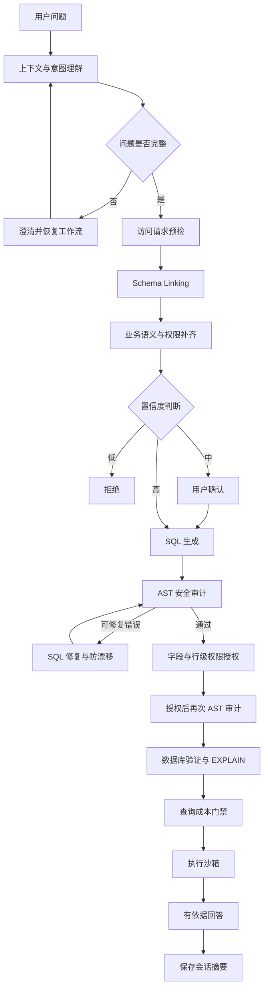

# Data Agent 项目收口指南

这份文档只解决三件事：快速看懂项目、快速找到代码、面试时能够讲清楚。

不要一上来背 27 个节点。先记住下面这一句话和 10 个阶段，再根据面试官追问进入具体代码。

建议阅读顺序：

- 第一次复习只看第 1、2、5、11 节。
- 准备看代码时再看第 4、7、8 节。
- 准备运行项目时看第 9、10 节。
- 第 3、6、12、13 节作为查阅材料，不需要背。

## 1. 一句话介绍项目

这是一个基于 LangGraph 的企业级 Text2SQL Agent：用户用自然语言提问，系统通过意图识别、Schema Linking 和业务语义层生成 SQL，再经过权限、安全、成本和执行沙箱治理，最后根据真实查询结果生成可追溯回答。

项目解决的不只是“让模型写 SQL”，还解决五类工程问题：

- 准确性：业务指标口径、时间语义、Schema Linking、置信度门禁。
- 安全性：AST 只读审计、字段权限、行级权限、二次审计。
- 稳定性：SQL 修复收敛、查询成本拦截、超时和结果截断。
- 交互性：歧义澄清、多轮会话记忆、有依据回答。
- 可验证性：离线评测、Golden Result、节点耗时、Token 和治理指标。

## 2. 面试只讲这 10 个阶段

```text
1. 上下文与意图理解
2. 请求权限预检
3. Schema Linking
4. 业务语义补齐
5. Schema 权限与置信度判断
6. SQL 生成与缓存
7. AST 安全审计与 SQL 授权
8. 数据库验证与查询成本检查
9. 执行沙箱
10. 有依据回答与会话记忆
```

完整主链路：



## 3. 核心链路和治理链路怎么区分

核心业务链路只有六件事：

```text
理解问题 → 找表字段 → 补业务口径 → 生成 SQL → 执行 SQL → 生成回答
```

其余节点都是治理能力：

| 治理方向 | 解决的问题 | 关键模块 |
|---|---|---|
| 歧义治理 | 问题信息不完整时不能猜 | `ambiguity_guard.py`、`clarify_intent.py` |
| 置信度治理 | Schema 证据不足时不能贸然生成 | `confidence_guard.py`、`confidence.py` |
| 安全治理 | 防止多语句、写操作、危险函数和越权字段 | `audit_sql.py`、`access_control.py` |
| 修复治理 | 避免重试时越改越偏 | `repair_guard.py` |
| 成本治理 | 防止笛卡尔积、大表全扫和超大结果 | `query_plan_guard.py`、`query_plan.py` |
| 回答治理 | 防止模型编造结果中不存在的数字 | `generate_answer.py`、`answer_grounding.py` |
| 可观测性 | 找出慢节点、Token 消耗和失败位置 | `observability.py`、`eval/llm_tracking.py` |

## 4. 代码里的 27 个节点

以下是当前 `app/agent/graph.py` 中的真实节点。面试官要求逐节点说明时再使用这张表。

| 顺序 | 节点 | 主要输入 | 主要输出 | 作用 |
|---:|---|---|---|---|
| 1 | `context_manager` | 原始问题、历史意图 | 改写后的问题、上下文继承记录 | 解析“那华东呢”一类追问 |
| 2 | `ambiguity_guard` | 当前问题、历史状态 | `query_intent`、歧义判断 | 判断是否缺年份、指标或 TopK |
| 3 | `clarify_intent` | 原问题、用户补充 | 合并后的问题 | 通过 LangGraph interrupt 暂停和恢复 |
| 4 | `access_request_guard` | 问题、用户角色和范围 | 请求权限结果 | 在检索和模型调用前拒绝敏感意图 |
| 5 | `extract_keywords` | 当前问题 | 关键词 | 为多路召回准备检索词 |
| 6 | `recall_column` | 问题、关键词 | 字段候选、召回来源 | 向量召回加精确别名召回 |
| 7 | `recall_value` | 问题、关键词 | 字段值候选 | 从 ES 找过滤值及对应字段 |
| 8 | `recall_metric` | 问题、关键词 | 指标候选、召回来源 | 从 Qdrant 召回指标定义 |
| 9 | `rerank` | 字段和指标候选 | 重排候选、分数 | 使用 Embedding 相似度筛选 TopK |
| 10 | `merge_retrieved_info` | 字段、值、指标候选 | 表、字段、指标 Schema | 补齐主外键并合并检索结果 |
| 11 | `filter_table` | 问题、候选 Schema、权限 | 过滤后的表字段 | 先做字段权限过滤，再让模型筛表字段 |
| 12 | `filter_metric` | 问题、指标候选 | 过滤后的指标 | 让模型保留与问题相关的指标 |
| 13 | `add_extra_context` | 问题、当前 Schema | 时间语义、指标语义、数据库信息 | 确保标准时间表和统一指标列不丢失 |
| 14 | `apply_access_policy` | Schema、角色、数据范围 | 模型可见 Schema、完整审计目录 | 再次过滤语义补齐后可能新增的字段 |
| 15 | `confidence_guard` | 意图、Schema、召回证据 | 分数、high/medium/low、动作 | 高分继续，中分确认，低分拒绝 |
| 16 | `confirm_confidence` | 中置信度解释、用户回答 | 确认结果 | 用户确认系统的业务理解 |
| 17 | `generate_sql` | 问题、Schema、语义规则、Few-shot | 原始 SQL | 先查语义缓存，未命中再调用模型 |
| 18 | `audit_sql` | 原始或修复 SQL、完整 Schema | 安全 SQL、AST 审计结果 | 只读、多语句、函数、表字段、LIMIT 审计 |
| 19 | `authorize_sql` | 已审计 SQL、访问上下文 | 授权或拒绝、行权限 SQL | 检查每个 CTE/子查询/UNION，并注入行级条件 |
| 20 | `audit_authorized_sql` | 权限改写后的 SQL、可见 Schema | 最终 AST 审计结果 | 防止系统注入后产生不安全或无效 SQL |
| 21 | `validate_sql` | 最终 SQL | 数据库验证结果、执行计划 | 让 MySQL 验证 SQL 并取得 EXPLAIN |
| 22 | `query_plan_guard` | EXPLAIN 计划、成本策略 | 通过或拒绝、稳定错误码 | 拦截笛卡尔积、大表全扫和估算行数超限 |
| 23 | `correct_sql` | SQL、验证或审计错误、原始 SQL | 修复候选 SQL、重试次数 | 让模型针对错误做最小修复 |
| 24 | `repair_guard` | 原始 SQL、前后修复 SQL、历史 | 通过或停止、修复历史 | 拦截重复、循环和业务语义漂移 |
| 25 | `execute_sql` | 全部审批结果、最终 SQL | 查询行、执行统计、图表建议 | 超时、并发限制、回滚和最大结果行数 |
| 26 | `generate_answer` | 问题、意图、有限结果行、指标口径 | 回答、亮点、限制、溯源 | 校验回答数字必须来自真实结果，失败则回退 |
| 27 | `remember_turn` | 问题、意图、SQL、结果摘要、回答 | 有界会话历史 | 只保存摘要，不保存无限结果和完整 Prompt |

并行关系需要单独记住：

- `recall_column`、`recall_value`、`recall_metric` 并行。
- `filter_table`、`filter_metric` 并行。
- 并行节点结束后，LangGraph 汇合状态再进入下一个阶段。

## 5. 一个例子从头走到尾

### 5.1 输入

用户问题：

```text
统计各地区的销售总额
```

访问上下文：

```json
{
  "principal_id": "manager-1",
  "role": "region_manager",
  "region_scope": "华东"
}
```

### 5.2 意图识别

`ambiguity_guard` 得到的核心意图类似：

```json
{
  "metrics": ["GMV"],
  "dimensions": ["region"],
  "time": {},
  "filters": [],
  "top_k": null
}
```

问题包含明确指标和维度，因此不需要澄清。

### 5.3 请求权限预检

`access_request_guard` 校验：

- `region_manager` 是已配置角色。
- `region_scope` 已提供。
- 问题没有要求客户姓名、手机号等敏感明细。

输出：

```json
{"passed": true, "code": "ACCESS_REQUEST_ALLOWED"}
```

如果用户问“列出客户姓名”，会在这里返回 `SENSITIVE_DATA_DENIED`，后续召回和大模型都不会执行。

### 5.4 Schema Linking

三路召回后，系统可能得到：

```text
字段：fact_order.order_amount、fact_order.region_id、dim_region.region_name
值：与当前问题相关的过滤值候选
指标：GMV
```

`merge_retrieved_info` 再补齐关联键：

```text
fact_order.region_id = dim_region.region_id
```

### 5.5 业务语义补齐

`add_extra_context` 命中 GMV 统一口径：

```text
GMV = SUM(fact_order.order_amount)
```

这一步防止模型把销售总额误写成 `AVG(order_amount)` 或其他口径。

### 5.6 Schema 权限与置信度

`apply_access_policy` 确保未授权字段不会进入 SQL Prompt，并为行级权限补齐 `fact_order.region_id`、`dim_region.region_id` 和 `dim_region.region_name`。

本例表、字段、指标和 JOIN 证据完整，`confidence_guard` 输出 high/proceed。

### 5.7 SQL 生成

模型生成的 SQL 可能类似：

```sql
SELECT
    r.region_name,
    SUM(f.order_amount) AS gmv
FROM fact_order AS f
JOIN dim_region AS r
    ON f.region_id = r.region_id
GROUP BY r.region_name;
```

### 5.8 第一次 AST 审计

`audit_sql` 会检查：

- 只能有一条查询语句。
- 不能出现 INSERT、UPDATE、DELETE、DROP 等操作。
- 不能出现 `SLEEP`、`LOAD_FILE` 等危险函数。
- 表和字段必须存在于当前 Schema。
- 不能使用暴露明细的 `SELECT *`。
- 没有 LIMIT 时自动增加外层 `LIMIT 10000`。

### 5.9 SQL 权限授权

`authorize_sql` 发现当前用户是华东地区经理，因此在读取事实表的查询作用域中注入：

```sql
EXISTS (
    SELECT 1
    FROM dim_region AS __acl_region
    WHERE __acl_region.region_id = f.region_id
      AND __acl_region.region_name = '华东'
)
```

最终 SQL 类似：

```sql
SELECT
    r.region_name,
    SUM(f.order_amount) AS gmv
FROM fact_order AS f
JOIN dim_region AS r
    ON f.region_id = r.region_id
WHERE EXISTS (
    SELECT 1
    FROM dim_region AS __acl_region
    WHERE __acl_region.region_id = f.region_id
      AND __acl_region.region_name = '华东'
)
GROUP BY r.region_name
LIMIT 10000;
```

如果 SQL 在 CTE、子查询或 UNION 的多个作用域里读取 `fact_order`，每个物理读取作用域都会单独注入条件。

### 5.10 二次审计、成本检查和执行

权限改写后的 SQL 再经过一次 AST 审计，然后 MySQL 验证并返回 EXPLAIN。

`query_plan_guard` 检查：

- `CARTESIAN_JOIN`
- `LARGE_FULL_SCAN`
- `ESTIMATED_ROWS_LIMIT_EXCEEDED`
- JOIN 表数量和查询成本

通过后，`execute_sql` 在执行沙箱中运行，并控制并发、超时、回滚和最大结果行数。

结果可能是：

```json
[{"region_name": "华东", "gmv": 107373}]
```

原始 Golden Result 包含全部地区，因此用 `region_manager + 华东` 测试时，`Expected result check` 不会通过；这说明行级权限改变了结果范围，不代表 SQL 或权限失败。

### 5.11 有依据回答和记忆

`generate_answer` 只能使用查询结果中的数字生成回答。如果模型编造了结果中不存在的数字，系统会回退到确定性回答。

`remember_turn` 最后保存问题、意图、SQL、行数、少量预览和回答摘要，供“那华东呢”一类追问使用。

## 6. 两条重要支线

### 6.1 澄清支线

例如用户问：

```text
1月份每天的销售额
```

系统发现月份明确但年份缺失：

```text
ambiguity_guard → clarify_intent → interrupt
```

用户补充“2025年”后，用相同 `thread_id` 和 `resume` 恢复，重新判断问题完整性，再进入 Schema Linking。

### 6.2 SQL 修复支线

当 SQL 解析或数据库验证失败时：

```text
audit/validate 失败
→ correct_sql 做针对性修复
→ repair_guard 比较前后 AST
→ 通过后重新 audit
```

最多重试三次。`repair_guard` 会拦截：

- `NO_CHANGE`：修复前后没有变化。
- `REPAIR_CYCLE`：出现 A → B → A 循环。
- `SEMANTIC_DRIFT`：指标、过滤条件、JOIN、分组、排序等业务语义发生漂移。

权限拒绝和查询成本拒绝不会交给模型修复，因为模型不应该尝试绕过权限或偷偷改变业务范围来降低成本。

## 7. 每项升级对应哪些代码

| 能力 | 优先阅读文件 |
|---|---|
| 工作流总图 | `app/agent/graph.py` |
| 全局状态 | `app/agent/state.py` |
| 业务指标和时间语义 | `app/agent/nodes/add_extra_context.py` |
| Schema Linking | `recall_column.py`、`recall_metric.py`、`recall_value.py`、`rerank.py`、`merge_retrieved_info.py` |
| SQL 生成与缓存 | `app/agent/nodes/generate_sql.py` |
| AST 安全审计 | `app/agent/nodes/audit_sql.py` |
| SQL 修复防漂移 | `app/agent/nodes/repair_guard.py` |
| 查询计划治理 | `app/agent/query_plan.py`、`app/agent/nodes/query_plan_guard.py` |
| 执行沙箱 | `app/agent/nodes/execute_sql.py`、`app/repositories/mysql/dw/dw_mysql_repository.py` |
| 歧义澄清 | `app/agent/query_intent.py`、`ambiguity_guard.py`、`clarify_intent.py` |
| 多轮会话 | `app/agent/conversation_memory.py`、`context_manager.py`、`remember_turn.py` |
| 置信度门禁 | `app/agent/confidence.py`、`confidence_guard.py`、`confirm_confidence.py` |
| 有依据回答 | `app/agent/answer_grounding.py`、`generate_answer.py` |
| 角色和数据权限 | `app/agent/access_control.py`、`access_request_guard.py`、`apply_access_policy.py`、`authorize_sql.py` |
| API 和会话身份绑定 | `app/services/query_service.py`、`app/api/schemas/query_schema.py` |
| 节点耗时 | `app/agent/observability.py` |
| 完整离线评测 | `eval/runner.py`、`eval/metrics.py` |
| 专项快速评测 | `eval/conversation_eval.py`、`confidence_eval.py`、`answer_grounding_eval.py`、`access_control_eval.py` |

## 8. 配置从哪里看

主要配置在 `conf/app_config.yaml`：

| 配置段 | 控制内容 |
|---|---|
| `rerank` | 字段和指标 TopK、相似度阈值 |
| `schema_linking` | 精确别名召回及加权 |
| `sql_execution` | 成本门禁、超时、并发、结果行上限 |
| `ambiguity` | 哪些歧义必须澄清、最多澄清轮数 |
| `conversation` | 会话 TTL、历史轮数、结果预览大小 |
| `confidence` | 高、中、低置信度阈值 |
| `answer_generation` | 回答超时、最大行数、数字容差 |
| `access_control` | 角色、表权限、字段权限、行级权限 |
| `sql_cache` | 缓存集合及相似度阈值 |
| `llm` | 模型名、API 地址和密钥 |

生产环境不要把密钥写在 YAML 中，应改为环境变量或 Secret Manager。

API 中的 `principal_id`、`access_role` 和 `region_scope` 目前只用于演示。生产环境必须从校验后的 JWT/SSO 身份中解析，不能相信请求体传来的角色。

## 9. 评测体系怎么理解

不要只看“SQL 能执行”。重要指标分为六层：

| 层次 | 代表指标 | 说明 |
|---|---|---|
| 生成层 | SQL generated | 模型是否输出 SQL |
| 语法层 | SQL executable | SQL 是否能在数据库执行 |
| Schema 层 | Table recall、Column Recall@K、JOIN key coverage | 表字段和关联键是否找对 |
| 语义层 | Expected result check、SQL rule check | 结果和业务口径是否正确 |
| 治理层 | Confidence、Query cost、Data access | 是否正确通过、确认或拒绝 |
| 工程层 | P50/P95、Token、缓存、节点耗时 | 性能和成本在哪里消耗 |

当前已验证的参考结果：

- 50 条阶段基线：SQL 生成、执行和表命中均为 100%；20 条 Golden Result 中 16 条通过，即 80%。
- 权限专项确定性评测：10/10。
- 单元测试：118 项通过。
- 华东地区经理端到端样例：成功注入 1 个行级权限作用域，权限节点总耗时约为毫秒级。

这些数字是对应报告生成时的快照。模型、数据、配置或代码变化后，应重新运行评测，不能把历史数字当作永久结论。

## 10. 常用命令

进入项目：

```bash
cd /Users/zhansuping/Downloads/面试/面试项目/问数/data-agent
```

运行全部单元测试：

```bash
.venv/bin/python -B -m unittest discover -s tests -p 'test_*.py'
```

运行 10 条权限专项测试，不调用大模型和数据库：

```bash
.venv/bin/python -B -m eval.access_control_eval
```

运行 1 条管理员端到端测试，结果可与全局 Golden 对比：

```bash
.venv/bin/python -B -m eval.runner \
  --limit 1 \
  --access-role admin \
  --principal-id admin-1 \
  --report eval/reports/smoke/admin_smoke_1.json
```

运行 1 条华东地区经理端到端测试：

```bash
.venv/bin/python -B -m eval.runner \
  --limit 1 \
  --access-role region_manager \
  --principal-id manager-1 \
  --region-scope 华东 \
  --report eval/reports/smoke/access_control_e2e_1.json
```

运行完整 50 条：

```bash
.venv/bin/python -B -m eval.runner \
  --report eval/reports/baseline/latest_50.json
```

电脑休眠会把端到端耗时统计拉长。完整评测时应关闭自动休眠，并保留报告用于前后对比。

## 11. 面试口语版

### 11.1 两分钟项目介绍

> 我这个项目是一个基于 LangGraph 的企业级 Text2SQL Agent。用户输入自然语言问题后，系统先做多轮上下文解析和歧义判断。如果问题不完整，就通过 interrupt 暂停工作流并向用户澄清。问题明确后，通过字段、取值和指标三路召回完成 Schema Linking，再由业务语义层补齐统一指标口径和标准时间规则。
>
> 在生成 SQL 前，我增加了 Schema 权限过滤和置信度门禁。SQL 生成后不会直接执行，而是先经过 sqlglot AST 安全审计，再检查表、字段和行级数据权限。权限改写后的 SQL 还会再审计一次，然后通过 MySQL EXPLAIN 检查笛卡尔积、大表全扫和估算行数，最后进入带并发、超时和结果截断的执行沙箱。
>
> 查询完成后，模型只能根据真实结果生成回答，并对回答中的数字做校验。整个链路记录节点耗时、模型调用、Token、缓存和治理结果，同时使用固定问题集和 Golden Result 做离线回归。

### 11.2 为什么项目节点这么多

> 核心业务其实只有理解问题、找 Schema、生成 SQL、执行和回答。节点多主要是因为我把准确性、安全性、成本、权限和可观测性拆成了独立门禁。这样每个节点输入输出清楚，可以单独测试，也能知道问题发生在哪一层。

### 11.3 为什么要审计两次

> 第一次审计模型生成的 SQL，检查只读、多语句、危险函数和 Schema 合法性。然后权限层可能会注入行级过滤条件，所以我对改写后的 SQL 再做一次 AST 审计，确保系统生成的条件本身也安全、字段也存在，之后才允许验证和执行。

### 11.4 怎么避免 SQL 越修越偏

> 每次修复只针对明确错误，修复后先进入 repair guard。它会比较候选 SQL、上一版 SQL 和最初 SQL 的 AST 语义特征，包括聚合、JOIN、过滤条件、分组、排序和 LIMIT。无变化、循环或语义漂移都会提前停止，最多重试三次。

### 11.5 权限是怎么做的

> 我分成三层。请求进入检索前先校验角色、数据范围和敏感意图；Schema Linking 后把无权字段从模型上下文中移除；SQL 生成后再按 AST 作用域检查所有物理表和字段，并给地区经理的每个事实表读取作用域注入地区条件。执行节点还会检查权限审批结果，防止图路由错误导致绕过。

## 12. 现在不需要记住什么

暂时不要背：

- 每个 TypedDict 的所有字段。
- 每个 Prompt 的完整文字。
- 27 个节点的逐行代码。
- 所有测试样例和历史报告数字。

优先掌握：

1. 十阶段主流程。
2. 一个端到端例子。
3. 五类治理问题分别由哪个模块解决。
4. 三个最重要的设计取舍：Schema Linking 的信息瓶颈、SQL 修复的语义漂移、权限改写后的二次审计。
5. 如何用离线评测证明升级没有回归。

## 13. 后续升级原则

当前项目已经适合作为大模型应用开发工程师的面试项目。后续先不增加新节点，只有满足以下条件才继续升级：

- 能明确说明要解决的线上问题。
- 能设计独立评测指标。
- 不与现有节点职责重复。
- 升级后仍能用一个例子讲清楚。

下一阶段如果继续，优先考虑线上 Trace、反馈和坏例沉淀闭环；但应在熟悉本指南和现有代码后再开始。
